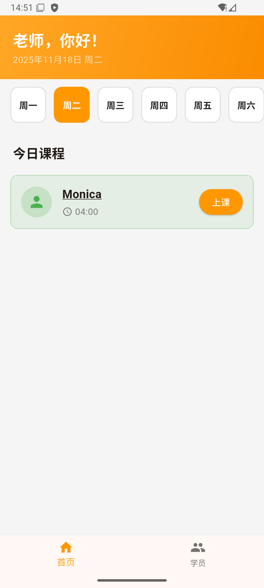
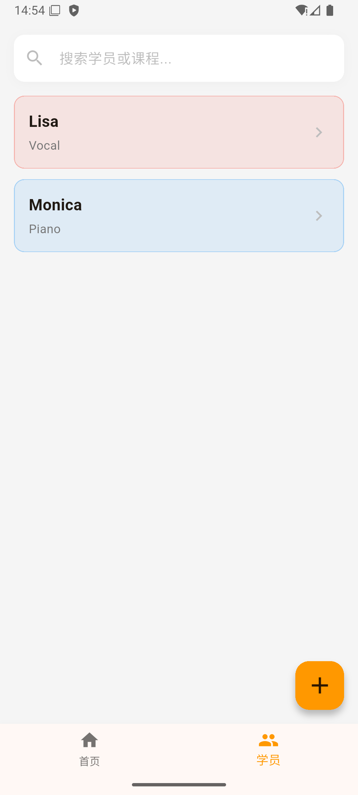
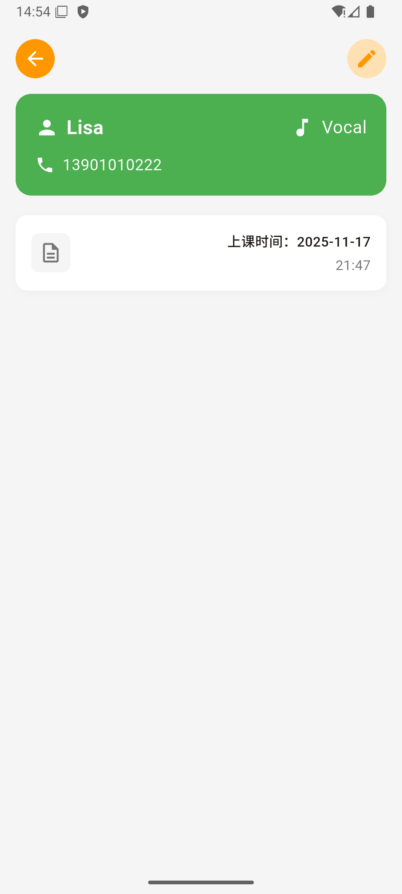
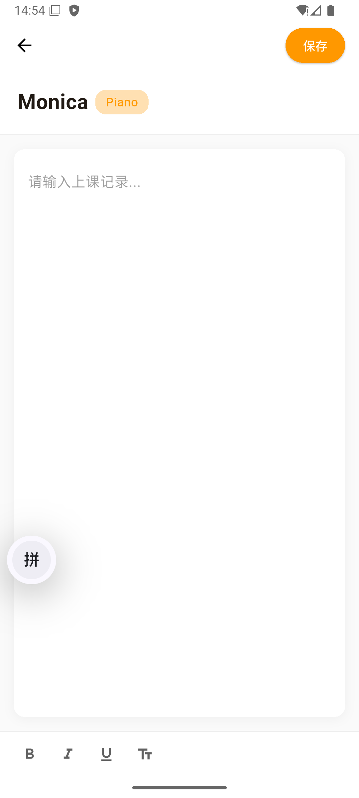

# TeachMate 教学助手

<div align="center">
  
  
  **一个简洁高效的家教管理应用，帮助老师轻松管理学员信息和上课记录**
  
  [](https://flutter.dev/)
  [](LICENSE)
</div>

## 📱 应用截图

<div align="center">
  
  
  
  
</div>

## ✨ 功能特性

### 🏠 智能首页

- **今日课程展示**：根据星期自动显示当天的课程安排
- **星期快速切换**：轻松查看不同星期的课程
- **一键上课**：点击"上课"按钮快速记录课程内容

### 👥 学员管理

- **完整信息管理**：记录学员姓名、课程、联系电话、上课时间
- **智能搜索**：快速查找学员信息
- **灵活编辑**：随时修改学员资料
- **便捷删除**：长按卡片或在编辑页面删除学员

### 📝 上课记录

- **详细记录**：为每个学员记录上课内容和进度
- **富文本编辑**：支持字体大小调节和 Markdown 格式
- **历史查看**：按时间顺序查看所有上课记录
- **编辑修改**：点击记录卡片即可编辑内容
- **智能日期**：自动根据学员设置的星期计算上课日期

### 💾 数据安全

- **本地存储**：使用 SQLite 数据库，数据安全可靠
- **离线可用**：无需网络连接，随时随地使用
- **数据持久化**：应用重启后数据不丢失

## 🎨 设计特色

- **橙色主题**：温暖活力的橙色渐变设计
- **精美图标**：笔记本造型的应用图标
- **启动画面**：优雅的 TeachMate 启动动画
- **简洁界面**：清晰的信息层级，操作直观便捷

## 🛠️ 技术栈

- **框架**：Flutter 3.10+
- **语言**：Dart
- **数据库**：SQLite (sqflite)
- **状态管理**：StatefulWidget
- **日期处理**：intl

## 📦 安装使用

### 前置要求

- Flutter SDK 3.10.0 或更高版本
- Android Studio / VS Code
- Android 设备或模拟器

### 安装步骤

```bash
# 1. 克隆仓库
git clone https://github.com/yangliu6605/teach_mate.git
cd tutor_notes

# 2. 安装依赖
flutter pub get

# 3. 运行应用
flutter run

# 4. 构建 APK
flutter build apk --release --target-platform android-arm64
```
